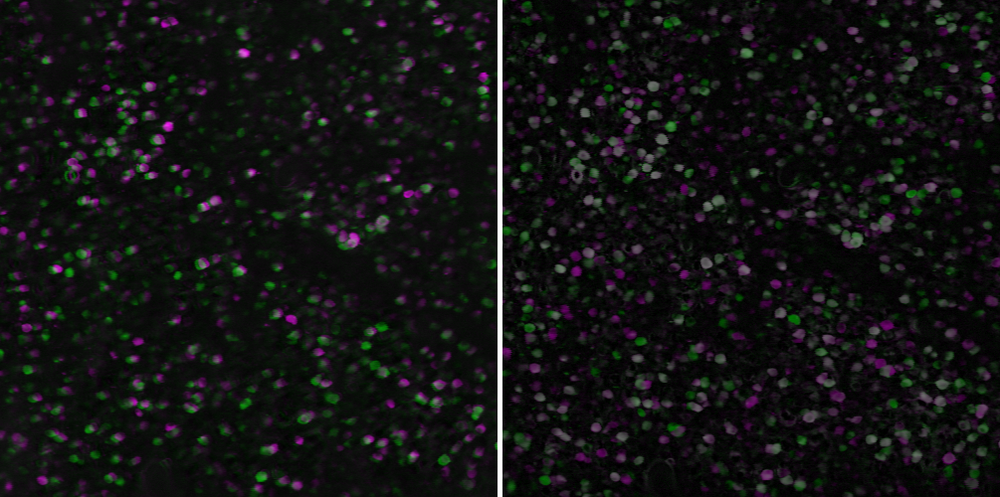

# Low computational-cost cell detection (LCCD) for a large field of view two-photon calcium imaging data
### Requirement
- Matlab

### Install
- download .zip

### Usage
#### Parameter setting
- LCCD_setting.m
   - set path
   - set running processes
   - set parameters

### Run LCCD
- run LCCD_pipeline.m

### Quality check
1. Motion correction
   - open .h5 file in 01_NoRMCorre in Fiji
   - check removal of motion artifacts
2. Misalignment of template
   - open image_std_xx.tif files in 02_simp_roi_detect in Fiji
   - stack images and check alignmend, then perform max intensitiy z-projection
   
3. ROI morphology
   - open ROI_Cell_color.tiff in 10_calculate_metrics
   - overlay z-projection image to the ROI_Cell_color and check the ROI poistion and morpholoy
4. Artifact detection
   - open Artifact_detection.pdf, Artifact_signal.pdf, and Cell_signal.pdf in 10_calculate_metrics and check the signals

### For further analysis
- dF_F0 -> load data from 09_remove_slowTimeScaleChange/After_SlowComponentCorrection.mat
- ROI metics -> load data from 10_calculate_metrics/ROI_metrics

